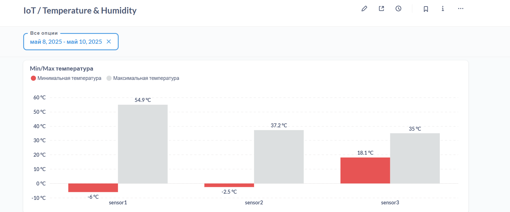
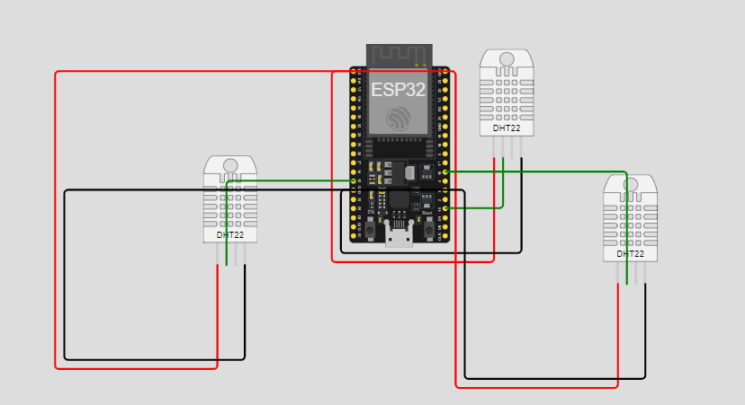

# Отслеживание показателей температуры и влажности





### Вводные

- Для симуляции используется Wokwi VSCode
- Для построения IoT проекта используется PlatformIO
- Для развертывания PostgreSQL и Metabase используется Docker Desktop

### Как работает

* Есть микроконтроллер ESP32, к которому подключены 3 датчика температуры и влажности DHT22.
* Каждые 5 секунд показатели с датчиков отправляются в PostgreSQL.
* К PostgreSQL подключена BI-система (Metabase)
* Промежуточное звено - сервер, написанный на python, который принимает данные с Serial-порта.



### Перенаправление данных с Serial-порта

Тема, заслуживающая отдельного внимания. 
Для перенаправления логов с Serial-порта используется расширение протокола telnet -- `rfc2217`.
Выглядит следующим образом:
1. Прописываем в `workwi.toml` следующую строчку:
```toml
rfc2217ServerPort = 4000
```

2. На сервере:
```python
ser = serial.serial_for_url('rfc2217://localhost:4000', baudrate=115200)
```

Теперь, когда делаем `Serial.print()`, при одновременной работе сервера и симулятора данные будут перенаправлены и их можно читать следующим образом:

```python
line = ser.readline().decode("utf-8").strip()
```

**Важно:** чтобы это корректно работало, надо правильно сбилдить проект с помощью PlatformIO.
